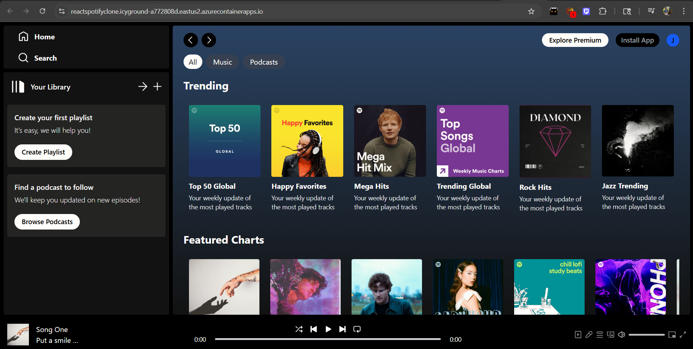
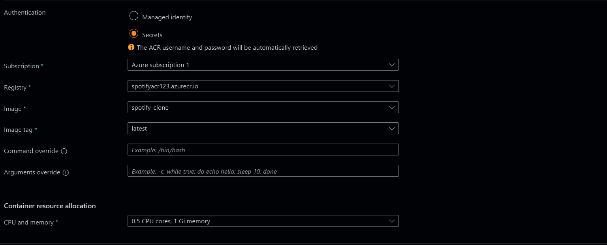
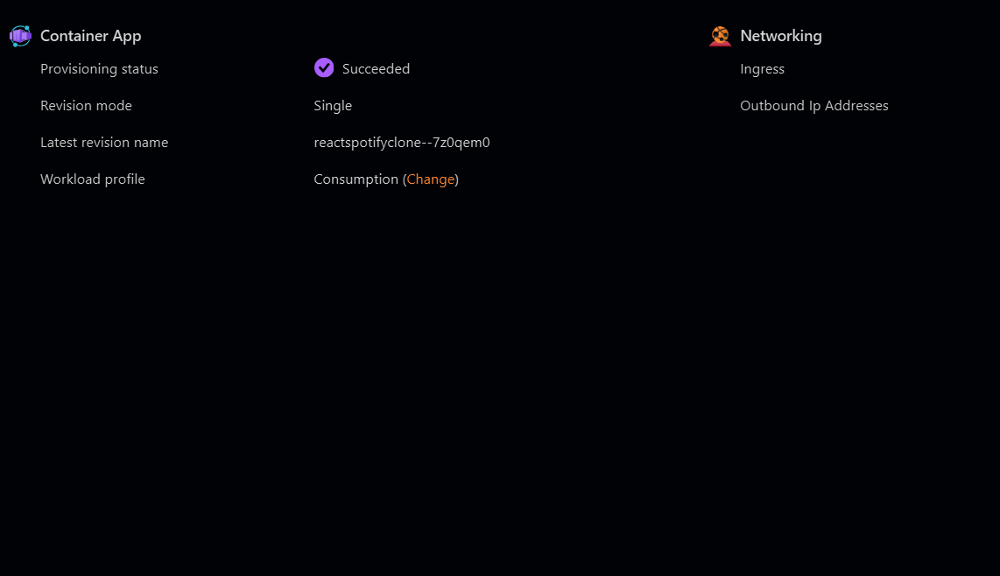
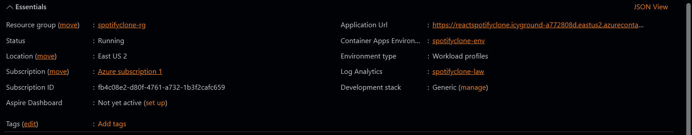
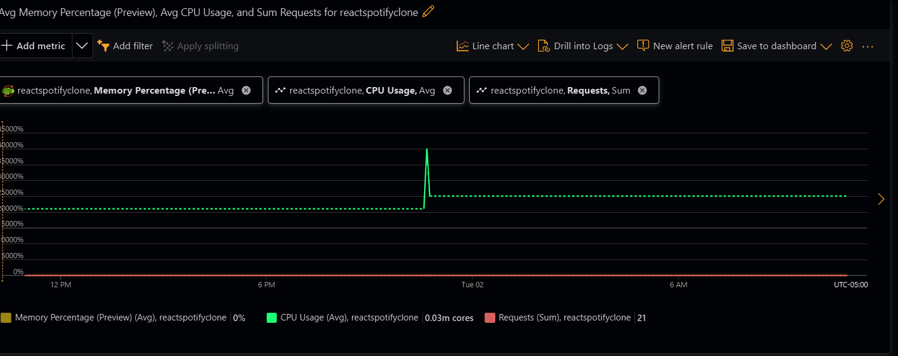

Spotify Clone (Vite + TypeScript React)

A Vite + TypeScript React application that replicates core Spotify functionality. This project showcases front-end development skills while also demonstrating containerization, cloud deployment, CI/CD pipelines, monitoring, and Kubernetes-based container orchestration.

# Spotify Clone (Vite + TypeScript React)

A **Vite + TypeScript React** application that replicates core Spotify functionality.  
This project demonstrates **front-end development skills** while also showcasing **containerization, cloud deployment, CI/CD pipelines, monitoring, and Kubernetes-based container orchestration**.

---

## Architecture Overview

### 1. Code Repository – GitHub

- All source code is maintained in the `main` branch.

### 2. CI/CD Pipeline – GitHub Actions

- Automatically builds Docker images.
- Tags images with timestamps for versioning.
- Pushes images to **Azure Container Registry (ACR)**.

### 3. Container Registry – Azure Container Registry (ACR)

- Stores versioned Docker images for both cloud deployment and local Kubernetes testing.

### 4. Cloud Deployment – Azure Container Apps & Local Kubernetes

- **Azure Container Apps (ACA):** pulls Docker images from ACR and runs them in the cloud.
- **Kubernetes (KIND + WSL2):** provides a local environment to test deployments, manage container scaling, and inspect logs.
- Health checks and replica management are handled via Kubernetes **Deployments** and **Services**.

### 5. End Users – Browser

- Access the live application through the ACA public endpoint or locally via Kubernetes NodePort.

---

## Kubernetes Deployment (Local)

This project includes a full Kubernetes setup to practice **DevOps** and **container orchestration** skills.

### Setup

- Installed **KIND (Kubernetes in Docker)** within WSL2 (Ubuntu).
- Provides a lightweight local cluster to test deployments without cloud resources.

### Containerization

- Docker images are built from local code and optionally pushed to **ACR** for Kubernetes to pull.

### Kubernetes Resources

- **`deployment.yml`** – defines the Spotify container deployment, including replicas, ports, and resource specifications.
- **`service.yml`** – exposes the deployment via a NodePort for local access.
- **Docker registry secret** – allows Kubernetes to pull images securely from **ACR**.

### Common Commands

```bash
# Deploy resources
kubectl apply -f k8/deployment.yml
kubectl apply -f k8/service.yml

# Check pod and service status
kubectl get pods
kubectl get svc

# View logs and troubleshoot
kubectl logs -f <pod-name>
kubectl describe pod <pod-name>


## Live Demo: Publicly Accessible Azure Container App

**React Spotify Clone** deployed as a **containerized app** on **Azure Container Apps** with full CI/CD pipeline:

[https://reactspotifyclone.icyground-a772808d.eastus2.azurecontainerapps.io/](https://reactspotifyclone.icyground-a772808d.eastus2.azurecontainerapps.io/)

## CI/CD Workflow:

1. Push code to main branch triggers GitHub Actions.
2. Docker image is built and tagged with timestamp.
3. Image pushed to Azure Container Registry (ACR).
4. Azure Container Apps (ACA) updated automatically with new image.
5. Health checks and versioning ensure reliability and traceability.

## Security Note:

For demonstration purposes, ACA deployment uses ACR admin credentials.
In production, a managed identity or service principal should be used.

## Monitoring and Logs











## Complete Tech Stack

Frontend: React + TypeScript + Vite
Containerization: Docker
Cloud: Azure Container Registry & Azure Container Apps
CI/CD: GitHub Actions
Monitoring: ACA logs + metrics
```
